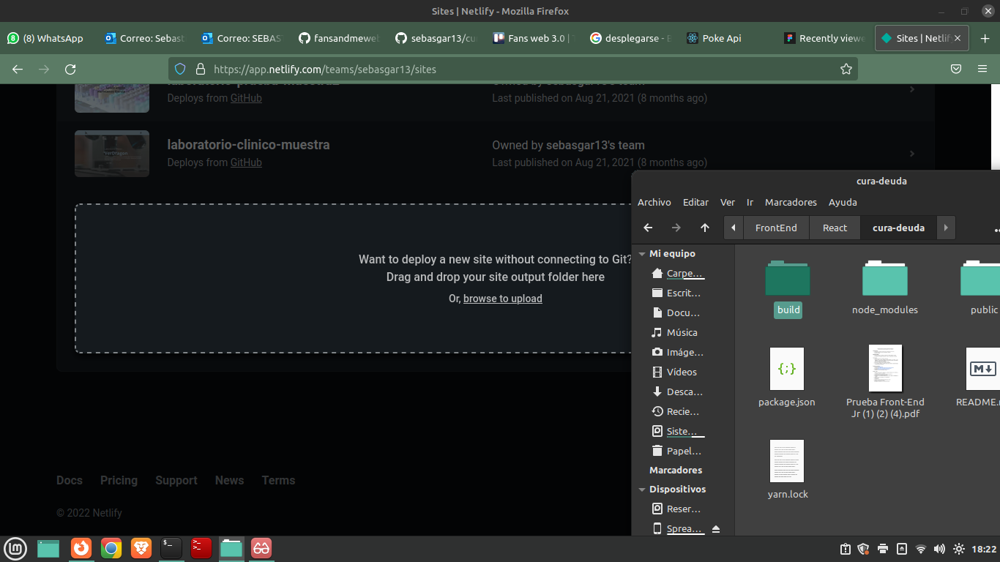
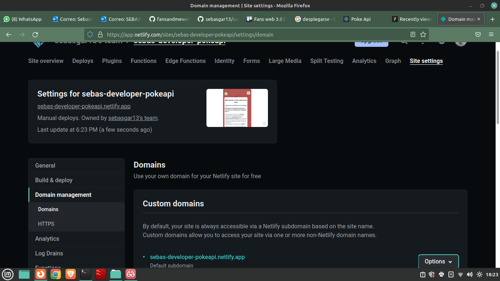

# Getting Started with Create React App

Esta aplicación es creada con [Create React App](https://github.com/facebook/create-react-app).
Aplicación desplegada [PokeApi-Sebas](https://sebas-developer-pokeapi.netlify.app/).
## Scripts con NPM

Utilizando NPM como gestor de paquetes

### `npm install`
Al descargar el repositorio de Git este script se utiliza para descargar las dependencias necesarias para ejecutar el proyecto.

### `npm start`

Correr la aplicación en modo desarrollo.\
Abre un servidor en el puerto 3000. [http://localhost:3000](http://localhost:3000)

### `npm run build`

Construye la aplicación (app) para producción en la carpeta `build`.\

The build is minified and the filenames include the hashes.\
Para subir la aplicación a producción se debe subir el contenido de la carpeta  (`\build`) generada con el comando `npm run build`. En teoría no se necesita hacer nada más. 

## Scripts con YARN

Utilizando YARN como gestor de paquetes

### `yarn`
Al descargar el repositorio de Git este script se utiliza para descargar las dependencias necesarias para ejecutar el proyecto.

### `yarn start`

Correr la aplicación en modo desarrollo.\
Abre un servidor en el puerto 3000. [http://localhost:3000](http://localhost:3000)

Corre el script para la construcción de la carpeta para producción

### `yarn build`

Construye la aplicación (app) para producción en la carpeta `build`.\

The build is minified and the filenames include the hashes.\
Para subir la aplicación a producción se debe subir el contenido de la carpeta  (`\build`) generada con el comando `yarn build`. En teoría no se necesita hacer nada más. 

## Despliegue en Netlify
Para desplegar la aplicación en Netlify se selecciona add new site y se arrastra la carpeta build/

;

Se deja caer sobre la parte indicada y se espera a que se despliegue el sitio.

;